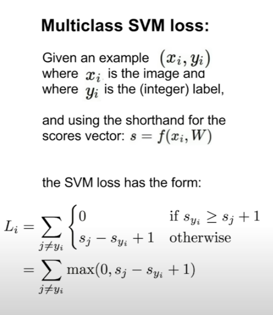
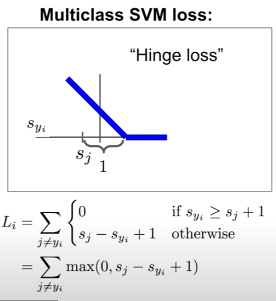
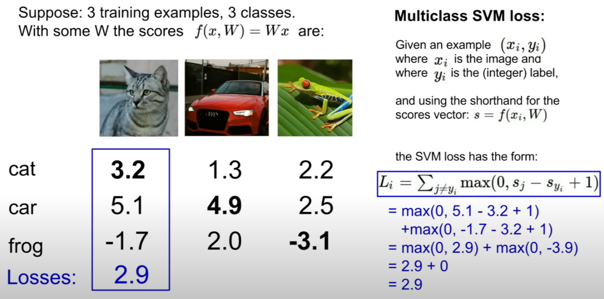
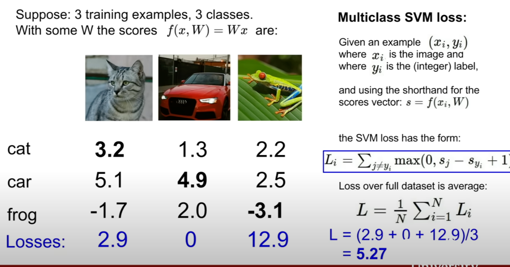

# Loss function

if the score for correct categories is greater than the score for incorrect categories by some safe margin one. it means that the truth categories is if it's much larger than any of the false categories.

As you can see truth categories increase, the loss will go down linearly.

Always loop over falsy classes first, and compare falsy class and truth class with max function.
for example, if we compare frog and cat(truth), you can see cat more than one(margin) than frog class which means that between these two classes we incur zero loss  

So, multiclass SVM loss for this training example will be the sum of losses across each of these pairs of classes

